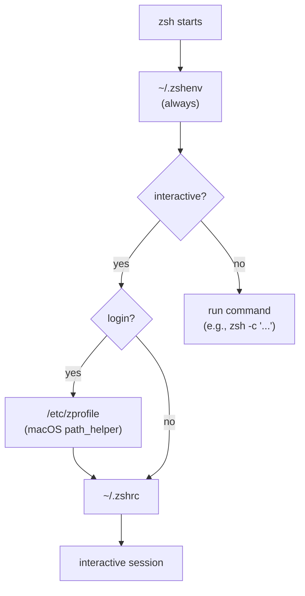
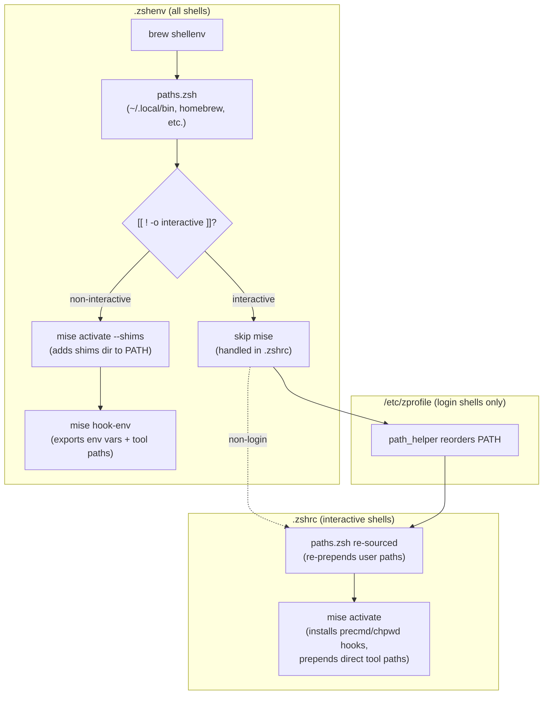

# Chris Lasher's Dotfiles

My collection of configuration files (a.k.a. "dot files") for working comfortably in a \*NIX environment.
This repository is easily deployed with the help of [chezmoi](https://www.chezmoi.io/).

Presently this repository is tailored towards macOS. Some configuration
values may not be appropriate for Linux.

## Deploying the configurations

1. [Install chezmoi](https://www.chezmoi.io/docs/install/)
2. Initialize with chezmoi

   ```sh
   chezmoi init git@github.com:gotgenes/dotfiles.git
   ```

3. Modify any necessary values in the `$XDG_CONFIG_HOME/chezmoi/chezmoi.toml` file:
4. Apply the configurations

   ```sh
   chezmoi apply
   ```

That's all there is to it! At this point, you will have successfully deployed your configurations.

## Per-directory git identity

The git configuration supports per-directory identity overrides (e.g., using a different `user.email` for work repositories) via git's native [`includeIf`](https://git-scm.com/docs/git-config#_conditional_includes) mechanism.

The tracked git config includes `~/.config/git/config.local`, which is silently ignored if the file does not exist.
To set up per-directory identity on a given machine:

1. Create `~/.config/git/config.local` with `includeIf` directives pointing to per-org config files:

   ```gitconfig
   [includeIf "gitdir:~/acmecorp/"]
       path = ~/.config/git/config.acmecorp
   ```

2. Create the per-org config file (e.g., `~/.config/git/config.acmecorp`):

   ```gitconfig
   [user]
       email = you@acmecorp.com
   ```

Repositories cloned under `~/acmecorp/` will now use `you@acmecorp.com` as the commit author email, while all other repositories use the default email from the tracked git config.

Neither `config.local` nor the per-org config files are tracked by this repository, so organization names and work email addresses stay private.

## Per-directory GitHub CLI account

If you have multiple GitHub accounts authenticated with `gh auth login`, the included `gh` wrapper script (`~/.local/bin/gh`) can automatically select the correct account based on your working directory.

The wrapper checks for a `GH_USER` environment variable.
If set, it fetches that user's token from the keyring and passes it to `gh` via `GH_TOKEN` for the current invocation, without changing the globally active account.
If `GH_USER` is not set, `gh` behaves normally with the default active account.

To configure per-directory account switching using [mise](https://mise.jdx.dev/):

1. Authenticate both accounts:

   ```sh
   gh auth login  # default account
   gh auth login  # work account
   ```

2. Set your default account as active:

   ```sh
   gh auth switch -u your-default-username
   ```

3. Create a `mise.toml` in the work directory (e.g., `~/acmecorp/mise.toml`):

   ```toml
   [env]
   GH_USER = "your-work-username"
   ```

Any `gh` command run from `~/acmecorp/` or its subdirectories will now use the work account.
The `mise.toml` files are not tracked by this repository, keeping account names private.

## Zsh and mise shell integration

[mise](https://mise.jdx.dev/) manages per-directory tool versions (node, python, go, etc.) and environment variables.
Integrating it with zsh on macOS requires careful coordination because of how zsh sources startup files and how macOS's `path_helper` reorders PATH.

### The problem

Zsh sources different files depending on the shell type:



The challenge: **`/etc/zprofile`** runs macOS's `path_helper`, which reorders PATH by demoting user-added entries behind system paths.
Any mise tool paths added in `.zshenv` get pushed to the end of PATH by the time `.zshrc` runs, so homebrew's versions of tools (e.g., node) take precedence.

Meanwhile, tools like [OpenCode](https://opencode.ai/) invoke `zsh -c 'command'` for shell commands, which only sources `.zshenv` — never `.zshrc`.
These non-interactive shells need mise tools and environment variables too.

### The solution

The configuration uses **two different mise activation strategies**, gated by shell type:



#### Non-interactive shells (`zsh -c`)

`.zshenv` activates mise with `--shims` (a lightweight PATH prepend) plus `hook-env` (which exports per-directory env vars and direct tool paths).
This gives the shell everything it needs in a single file, with no interactive hooks.

#### Interactive shells (terminal sessions)

`.zshenv` **skips** mise entirely for interactive shells.
This is deliberate: any mise PATH entries added here would be demoted by `path_helper` in login shells, causing homebrew's tool versions to take precedence.

Instead, `.zshrc` runs full `mise activate`, which installs `precmd` and `chpwd` hooks.
These hooks automatically update PATH and environment variables whenever you change directories, giving you per-project tool versions and env vars.

### Key detail: `paths.zsh` deduplication

`paths.zsh` is sourced in both `.zshenv` and `.zshrc` (the second time to undo `path_helper`'s reordering).
It uses `typeset -aU path` to deduplicate PATH entries, then immediately `typeset +U path` to remove the permanent unique constraint.
Without the `+U`, zsh would silently block any later attempt to re-prepend an entry that already exists elsewhere in PATH — which would prevent mise from moving its tool paths back to the front.
