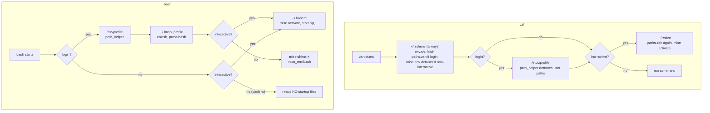
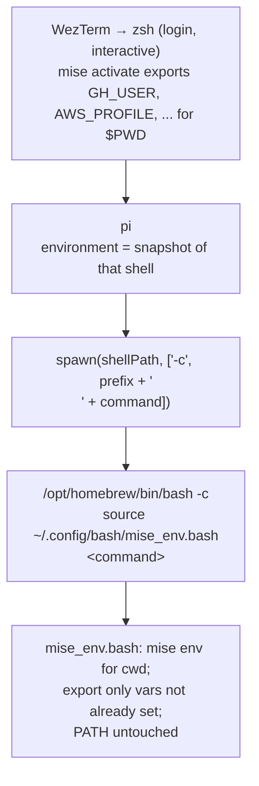

# Chris Lasher's Dotfiles

My collection of configuration files (a.k.a. "dot files") for working comfortably in a \*NIX environment.
This repository is easily deployed with the help of [chezmoi](https://www.chezmoi.io/).

Presently this repository is tailored towards macOS. Some configuration
values may not be appropriate for Linux.

## Deploying the configurations

1. [Install chezmoi](https://www.chezmoi.io/docs/install/)
2. Initialize with chezmoi

   ```sh
   chezmoi init git@github.com:gotgenes/dotfiles.git
   ```

3. Modify any necessary values in the `$XDG_CONFIG_HOME/chezmoi/chezmoi.toml` file:
4. Apply the configurations

   ```sh
   chezmoi apply
   ```

That's all there is to it! At this point, you will have successfully deployed your configurations.

## Per-directory git identity

The git configuration supports per-directory identity overrides (e.g., using a different `user.email` for work repositories) via git's native [`includeIf`](https://git-scm.com/docs/git-config#_conditional_includes) mechanism.

The tracked git config includes `~/.config/git/config.local`, which is silently ignored if the file does not exist.
To set up per-directory identity on a given machine:

1. Create `~/.config/git/config.local` with `includeIf` directives pointing to per-org config files:

   ```gitconfig
   [includeIf "gitdir:~/acmecorp/"]
       path = ~/.config/git/config.acmecorp
   ```

2. Create the per-org config file (e.g., `~/.config/git/config.acmecorp`):

   ```gitconfig
   [user]
       email = you@acmecorp.com
   ```

Repositories cloned under `~/acmecorp/` will now use `you@acmecorp.com` as the commit author email, while all other repositories use the default email from the tracked git config.

Neither `config.local` nor the per-org config files are tracked by this repository, so organization names and work email addresses stay private.

## Per-directory GitHub CLI account

If you have multiple GitHub accounts authenticated with `gh auth login`, the included `gh` wrapper script (`~/.local/bin/gh`) can automatically select the correct account based on your working directory.

The wrapper checks for a `GH_USER` environment variable.
If set, it fetches that user's token from the keyring and passes it to `gh` via `GH_TOKEN` for the current invocation, without changing the globally active account.
If `GH_USER` is not set, `gh` behaves normally with the default active account.

To configure per-directory account switching using [mise](https://mise.jdx.dev/):

1. Authenticate both accounts:

   ```sh
   gh auth login  # default account
   gh auth login  # work account
   ```

2. Set your default account as active:

   ```sh
   gh auth switch -u your-default-username
   ```

3. Create a `mise.toml` in the work directory (e.g., `~/acmecorp/mise.toml`):

   ```toml
   [env]
   GH_USER = "your-work-username"
   ```

Any `gh` command run from `~/acmecorp/` or its subdirectories will now use the work account.
The `mise.toml` files are not tracked by this repository, keeping account names private.

## Shell startup and mise integration

Both zsh (the interactive shell) and bash (Pi's command shell, and an occasional interactive shell) are configured to produce the same environment and PATH.
[mise](https://mise.jdx.dev/) manages per-directory tool versions (node, python, go, etc.) and environment variables in both.

Three rules drive the design:

1. **Login shells build PATH; non-login shells inherit it verbatim.**
   A terminal tab starts from the bare system PATH and must build it.
   A `zsh -c` or `bash -c` spawned by an editor or agent inherits an already-correct PATH; re-prepending entries would demote `~/.local/bin` wrappers or project-local bin dirs the parent put first.
2. **mise env vars in non-interactive shells are defaults.**
   A value already in the environment (e.g., an inline override like `AWS_PROFILE=x cmd`) wins over the `mise.toml` value.
3. **Env vars are defined once**, in `~/.config/shell/env.sh`, which both shells source.
   It is restricted to syntax that zsh and bash treat identically (plain `export`, `case`, `[ ]`, `command -v`); PATH logic is per shell.
   Aliases are likewise shared via `~/.config/shell/aliases.sh`.

### Which files each shell reads


```mermaid
graph TD
    subgraph zsh
        Z0["zsh starts"] --> Z1["~/.zshenv (always)<br/>env.sh, fpath;<br/>paths.zsh if login;<br/>mise env defaults if non-interactive"]
        Z1 --> Z2{login?}
        Z2 -- yes --> Z3["/etc/zprofile<br/>path_helper demotes user paths"]
        Z2 -- no --> Z4{interactive?}
        Z3 --> Z4
        Z4 -- yes --> Z5["~/.zshrc<br/>paths.zsh again, mise activate"]
        Z4 -- no --> Z6["run command"]
    end
    subgraph bash
        B0["bash starts"] --> B1{login?}
        B1 -- yes --> B2["/etc/profile<br/>path_helper"]
        B2 --> B3["~/.bash_profile<br/>env.sh, paths.bash"]
        B3 --> B4{interactive?}
        B4 -- yes --> B5["~/.bashrc<br/>mise activate, starship, ..."]
        B4 -- no --> B6["mise shims +<br/>mise_env.bash"]
        B1 -- no --> B7{interactive?}
        B7 -- yes --> B5
        B7 -- "no (bash -c)" --> B8["reads NO startup files"]
    end
```

The key difference is where macOS's `path_helper` runs.
In zsh it runs in `/etc/zprofile`, _between_ `.zshenv` and `.zshrc`, and demotes everything `.zshenv` prepended behind the system paths; so `paths.zsh` is sourced twice, once in each file.
In bash it runs in `/etc/profile`, _before_ `~/.bash_profile`, so `paths.bash` runs once and nothing reorders PATH afterwards.

### Pi (`bash -c`)

Pi runs every command as `bash -c <command>`, inheriting Pi's own environment.
`bash -c` reads no startup files, so the inherited PATH is kept verbatim for free, but nothing applies the `mise.toml` env vars of the directory the command runs in.
Pi's `shellCommandPrefix` setting fills that gap: Pi pastes it above every command.


```mermaid
graph TD
    A["WezTerm → zsh (login, interactive)<br/>mise activate exports GH_USER, AWS_PROFILE, ... for $PWD"] --> B["pi<br/>environment = snapshot of that shell"]
    B --> C["spawn(shellPath, ['-c', prefix + '\n' + command])"]
    C --> D["/opt/homebrew/bin/bash -c<br/>source ~/.config/bash/mise_env.bash<br/>&lt;command&gt;"]
    D --> E["mise_env.bash: mise env for cwd;<br/>export only vars not already set;<br/>PATH untouched"]
```

`~/.pi/agent/settings.json` (not managed by this repository):

```json
{
  "shellPath": "/opt/homebrew/bin/bash",
  "shellCommandPrefix": "source ~/.config/bash/mise_env.bash"
}
```

mise-managed tools resolve correctly without any PATH changes, because the inherited PATH contains the mise shims directory and shims look up the tool version per directory at run time.

### Non-interactive zsh (`zsh -c`, OpenCode's `zsh -l -c`)

`.zshenv` parses `mise env` output instead of using `mise hook-env` or `mise activate --shims`.
`hook-env` unconditionally overwrites env vars (breaking inline overrides), and both it and `--shims` prepend `/opt/homebrew/bin`, demoting `~/.local/bin` wrappers.
Env vars are applied as defaults in every non-interactive zsh; mise PATH entries (install dirs and the shims dir) are prepended only in login shells, per rule 1.

### Interactive shells

`.zshrc` and `.bashrc` run full `mise activate`, which installs prompt hooks that update PATH and env vars whenever you change directories.
`.zshenv` skips mise for interactive shells, because `path_helper` would demote anything it added.

### Key details

- `paths.zsh` uses `typeset -aU path` to deduplicate PATH, then immediately `typeset +U path` to remove the permanent unique constraint.
  Without the `+U`, zsh would silently block any later attempt to re-prepend an entry that already exists elsewhere in PATH — which would prevent mise from moving its tool paths back to the front.
- `brew shellenv` is not used: `env.sh` exports its `HOMEBREW_*` variables statically (templated per OS), and PATH/fpath are added by the per-shell files.
  `brew shellenv` costs a subprocess in every shell and prepends to `INFOPATH`/`FPATH` unconditionally, so every nested shell added another copy.
  `INFOPATH` and `fpath` are now added idempotently.
